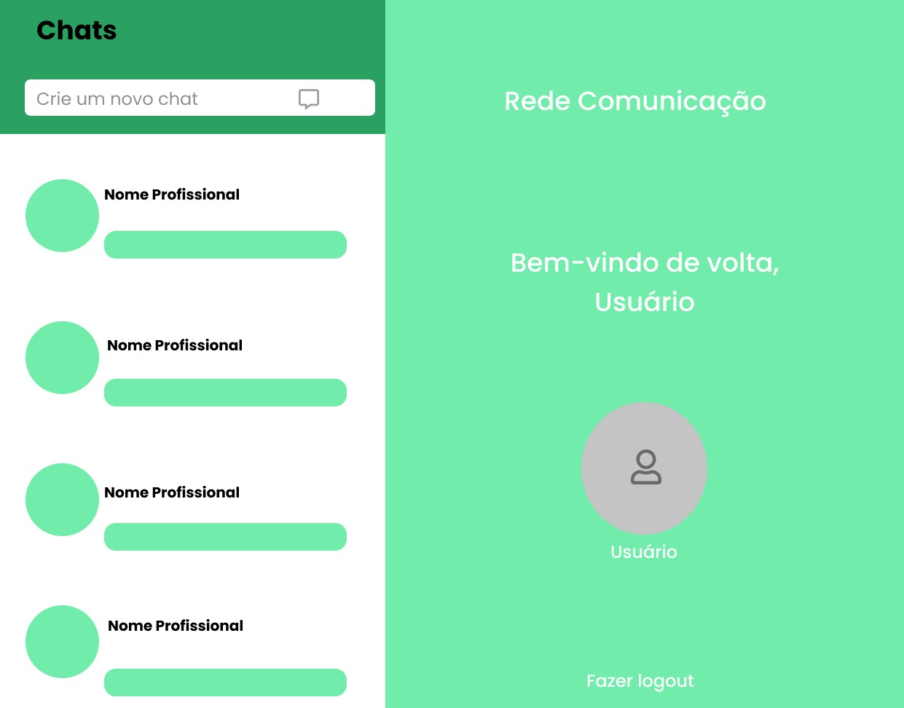
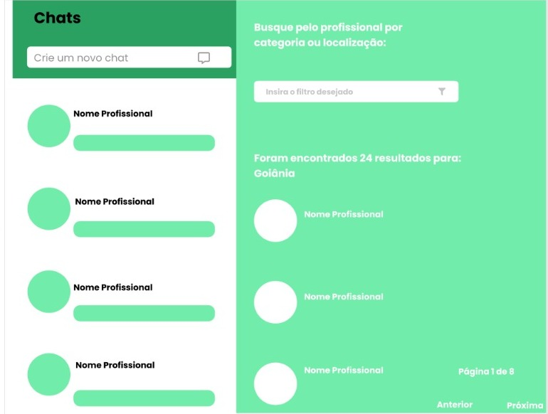
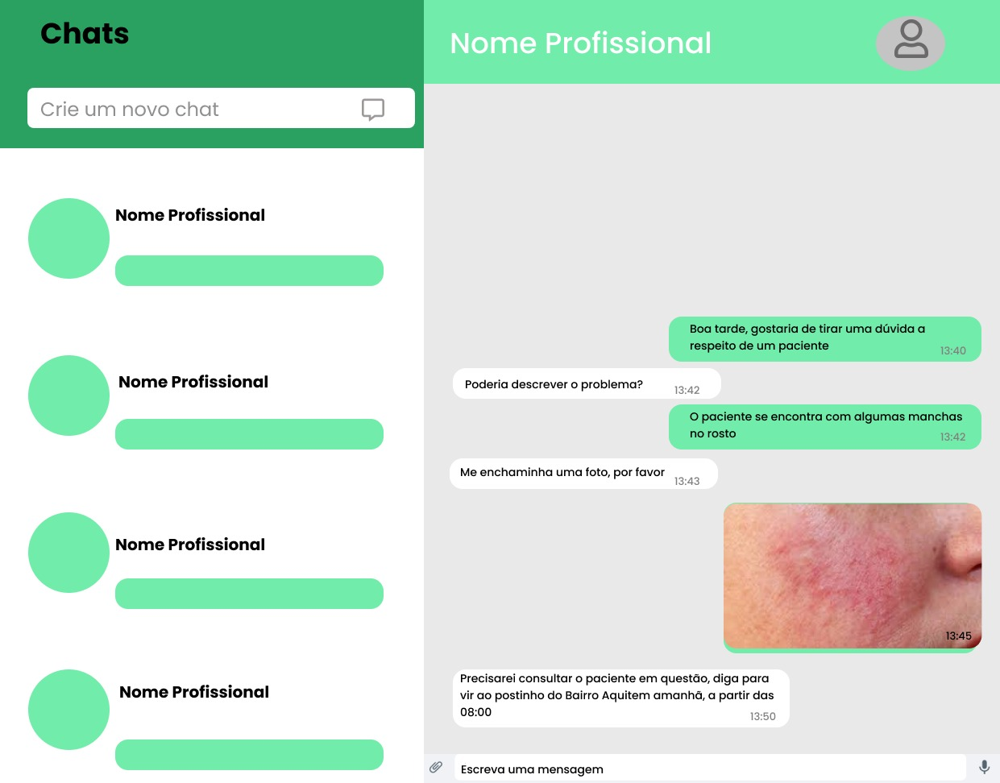
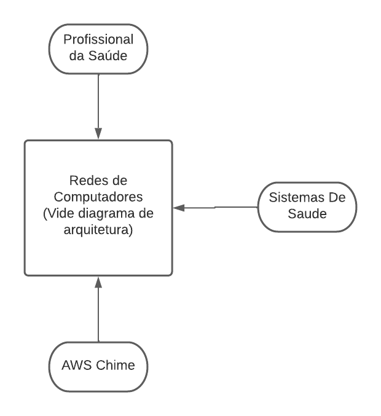
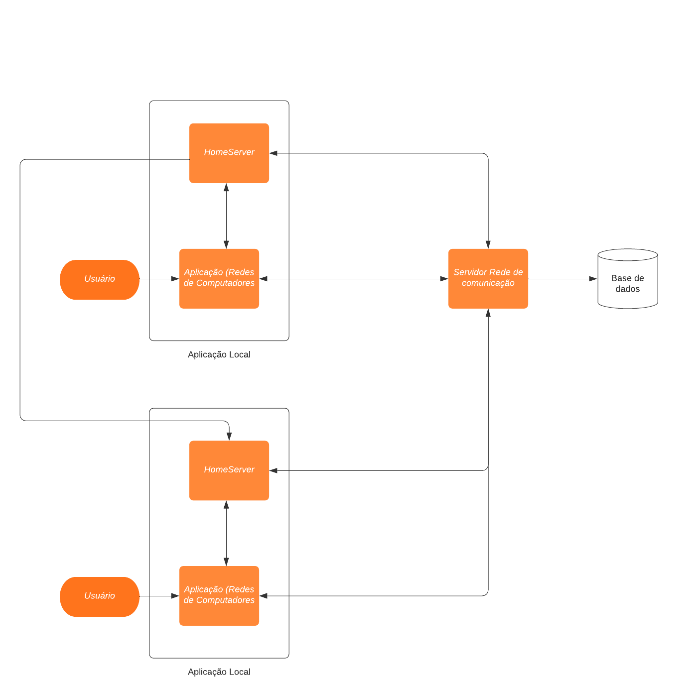

# Problema

Profissionais de saúde necessitam trocar informações entre eles visando a continuidade do cuidado de seus pacientes.
Uma rede deve ser criada visando facilitar e agilizar a interação entre profissionais da saúde. 
Possivelmente com a configuração de horários, por exemplo, na qual a comunicação é permitida, sugerida, assim como notificações e outros.
Deve ser possível realizar buscas por meio da especialidade, endereço de estabelecimento, nome do estabelecimento e outros. 
Também deve ser possível a troca de imagens e de texto por tempo limitado.
A rede deve viabilizar a comunicação sem revelar formas de contato pessoais como telefone, por exemplo.

## Projeto (design)

O software será composto por uma aplicação web integrada com um banco de dados.

### Descrição

A proposta é criar um sistema de chat entre profissionais de saude.

A aplicação terá a função de cadastro e de login para cada profissional de saúde. Ao realizar o cadastro os dados serão populados no banco e disponibilizados para que outros especialistas vizualizem e  entrem em contato.
Após o login, o profissional poderá acessar chat ou buscar por um novo profissional de saúde, escolhendo por especialidade, endereço, nome do estabelecimento ou profissional.

Após iniciar um chat com um profissional de saúde e enviar mensagens de texto ou imagem, o outro clínico será notificado por email de que um novo chat foi criado.
Dentro dos chats os profissionais de saúde podem optar por adicionar arquivos, ou enviar mensagens de texto.

Durante a criação do chat o responsavel pela criação pode determinar por quanto tempo esse chat continuará aberto, onde cada mensagem será limitada a 1000 caracteres e envios de arquivos serão restritos a 10 MB.

### Interface com o usuário

Ao abrir a aplicação, os usuários irão se deparar com uma tela de login. Nessa tela haverá a orientação para que eles insiram seus emails e senhas para realizar o login ou optem por criar uma nova conta.  

Na tela de criação de conta eles poderão fornecer seus emails, senha, nome, CRM, especialidade, local de trabalho e endereço.

Após realizar o login, haverá uma listagem de chats iniciados, ao final da listagem existirá um botão para a criação de novos chats.

Durante a criação de novos chats, o usuário será apresentado à seleção de filtros, podendo preencher o filtro de especialidade, endereço, nome do estabelecimento ou nome do trabalhador. Após aplicar filtros definidos, serão listados todos os profissionais que se incluem neste. A partir dessa lista será possivel criar um novo chat com o respectivo profissional.

Dentro dos chats serão listadas as mensagens enviadas. Mensagens de texto ficarão disponíveis diretamente e arquivos e fotos enviadas possuirão seus downloads permitidos. Também será disponibilizado um campo para preenchimento de texto e um botão para envio, assim como um botão para anexo de arquivos ou imagens.

### Segurança de dados

Devido a informações sensiveis que serão enviadas e armazenadas na aplicação é necessário ter medidas de contenção para evitar que ocorra vazamentos ou ataques. Dessa forma o programa deve utilizar métodos e ferramentes para garantir que as mensagens trocadas entre profissionais da saúde:

Senhas devem ser armazenadas como hashMD5 visto que não existe conversão de hash para texto e só seria possivel determinar a senha dos usuários caso o invasor tenha a mesma em uma tabela de conversão de texto para hash.

A aplicação deve realizar e verificar autenticação em todas as requisições e etapas, para evitar de permitir alguma requisição insegura.

O servidor principal deve permitir apenas as requisições desejadas para o funcionamento da aplicação e bloquear qualquer acesso indesejado ou que seja criado com intuito de ser utilizado apenas pela equipe de desenvolvimento, visto que caso esses acessos extras sejam descobertos poderiam gerar falhas de segurança e vazamentos de dado

Durante a implementação e ciclo de vida do produto deve se verificar as vulnerabilidades das dependências e aplicações utilizadas e realizar gerenciamento de versões para evitar a possibilidade de algum ataque que se beneficie dessas vulnerabilidades.

O uso da implementação dos homeservers do Matrix.Org irá contar com implementação de uma segurança e criptografia na troca de mensagens entre usuários, facilitando a implementação dos procedimentos de segurança para a proteção das mensagens.

A comunicação entre aplicação local e servidor principal deve ser feita feita utilizando criptografia e cookies de segurança para confirmar origem das mensagens. 

O banco de dados e o serviço back-end devem ser estabelecidos no mesmo servidor e o banco terá conexão aberta unicamente para o back-end, de forma a impedir acessos indevidos ao mesmo.

### Banco de dados

Utilizar padrão repository, como referencia o programa pode ter as tabelas:

Profissionais da saúde, conterão: senha, nome, email, especialidade, profissao, local_de_trabalho, endereço

Chats, conterão: profissional_criador, profissional_remetente

Mensagens, conterão: chat, tipo, conteudo, nome_arquivo

### Sistema de comunicação entre Partes

Será utilizado o AWS Chime para a comunicação entre partes. Com intuito de circunvir a sobrecarga de um servidor unico com a implementação de mensagens em tempo real, redução de partes que possam necessitar de manutenção, facilidade de construção e possibilitar que o programa seja executado em navegadores ou como API por outras aplicações. Apesar da implicação de custos ao uso do AWS Chime, a escolha de utilizar essa funcionalidade se deve a redução de complexidade da aplicação ao não necessitar de focar esforços na criação integral de uma comunicação em tempo real.

Entre os serviços propostos pelo AWS Chime, pode-se citar a realização de chats, chamadas de vídeo, compartilhamento de tela e agendamentos de reuniões. Além disso, o serviço possui uma política de preços bem flexível. O pagamento ocorre conforme o uso, sem taxas adiantadas. Os desenvolvedores que implementarem o SDK podem optar por implementar as funcionalidades que forem desejadas no projeto, no caso do Redes de Comunicação será utilizado a troca de mensagens e arquivos.

#### Explicação da implementação e funcionalidade do AWS Chime

A integração do sistema Redes de Comunicação com o AWS Chime se dará atráves da utilização de ferramentas e modelos disponibilizados pela Amazon para a implementação. O SDK possibilita uma aplicação Web se comunicar com os servidores da AWS, realizando requisições através do javascript.

O AWS Chime permite também a integração de identificadores criados pela propria aplicação de servirem como a identificação dentro do AWS, permitindo integrar a funcionalidade de envio e recebimento de mensagens a uma entidade de profissionais da saude. Para isso basta utilizar AppInstanceUser, e determinar o id do AppInstanceUser (nomenclatura do AWS Chime para usuários da funcionalidade, contém um id de identificação e apartir disso pode realizar as funções disponiveis do AWS Chime) de um profissional da saude como o mesmo id da entidade profissional da saude no banco da aplicação Redes de Comunicação. A criação do AppInstanceUser ocorrerá em conjunto com o cadastro de um profissional da saude. Sua integração com a entidade do banco de dados permitirá que ao realizar o filtro de um profissional da saude na tela de filtro, possa consultar o banco de dados pelas informações de contato do AppInstanceUser gravados na entidade profissional da saude pesquisada e retornar para a aplicação web para a criação de chats e envio de mensagens. Essa informação também permitirá que ao realizar um login a aplicação web possa obter via requisições os chats ao qual participa e as mensagens dos chats.

Para que ocorra a comunicação entre dois profissionais da saude, ele necessita de criar um canal através de uma requisição que será feita pela aplicação web, seguindo os parametros de mensagem de criação de canal do AWS e passar o outro profissional como o outro membro do canal. Para o intuito da aplicação todos canais serão privados, para impedir acesso de terceiros as mensagens ou a visualizar o canal.

O envio de mensagens consiste em enviar mensagens para canais em especifico, a criação de chats será feita pelo servidor principal e ao receber as informações elas serão atribuidas em uma lista para facilitar a exibição dos chats na tela, de forma a listar na tela o nome do outro profissional de saude. Ao finalizar a criação o servidor retornará o identificador do chat para a parte web.

Para que sejam listados as conversas será enviado uma requisição ao servidor principal que enviará uma mensagem ao AWS de ListChannels, para obter os canais de mensagem do profissional da saude, apartir dessas mensagens será retornado uma lista com os identificadores dos canais e os profissionais da saude.

Para que sejam listados as mensagens da conversa basta a aplicação Web enviar ao AWS uma requisição ListChannelMessages com o identificador do canal.

### Diagrama de Contexto

### Diagrama de Arquitetura

### Estrutura do projeto

O projeto será dividido em 4 partes:

A primeira parte é o AWS Chime que tem como papel realizar a comunicação em tempo real dos profissionais da saude. Ela será acessada pelo front-end e pela aplicação do Redes de comunicação.

A segunda parte é a aplicação Redes de Comunicação, ela será a aplicação principal e será hospedada em um servidor de responsabilidade da Redes de Comunicação. Ele terá o papel de realizar a conexão com o banco de dados, fornecer uma relação dos dados dos profissionais da saúde e seus usuários do AWS Chime, realizar validação de login e transcrever a listagem de chats de um usuário para a lista de profissionais que ele tem conversas. A aplicação receberá requisições do front-end e irá realizar requisições ao AWS Chime.

O terceira parte é o banco de dados, será um banco de dados relacional e terá como função armazenar os dados dos profissionais da saude. Será acessado unicamente pela aplicação

A quarta parte é o front-end, sendo esse dividido em duas formas:

 - A primeira será o front-end do site redes de comunicação, que será a interface descrita a cima e será a forma basica de acessar a aplicação. Terá como papel receber os comandos do usuário e retornar uma interface visual e as informações necessárias.
 - A segunda será um plugin javascript que poderá ser adicionado em outras aplicações web e permitirá integrar uma interface do redes de comunicação ou fornecer uma integração entre o front-end de outras aplicações, o AWS Chime e a aplicação Redes de Comunicação

### Escalabilidade do Projeto

A escalabilidade é a forma de permitir que outras aplicações tenham acesso as funcionalidades do Redes de Comunicação e permitir uma facil integração com elas. 

A escalabilidade do projeto será feita apartir de um plugin javascript. Será criado um plugin javascript com os códigos similares ao front-end normal da aplicação, ele terá duas formas de operação

A primeira forma irá renderizar uma janela com interface similar a interface normal. Ela terá de ser capaz de ser redimensionada para os tamanhos delimitados pelo individuo que estará implementando o plugin na sua aplicação. Essa forma do plugin irá permitir requisições ao AWS Chime e a aplicação Redes de Comunicação, funcionando de forma a replicar a pagina web do Redes de Comunicação como uma janela de outra aplicação web.

A segunda forma é um segundo plugin que irá funcionar como um client para a aplicação Redes de Comunicação, recebendo entradas especificas nos métodos e retornando o conteudo como mensagens e chats abertos do profissional. O intuito desse plugin é permitir que a implementação do Redes de Comunicação seja feita utilizando uma interface de autoria de terceiros, de forma a integrar melhor com os seus sistemas.

## Requisitos

Consulte o diretório [requisitos](../avaliacao4/requisitos), que contém as listagens dos requisitos do software
