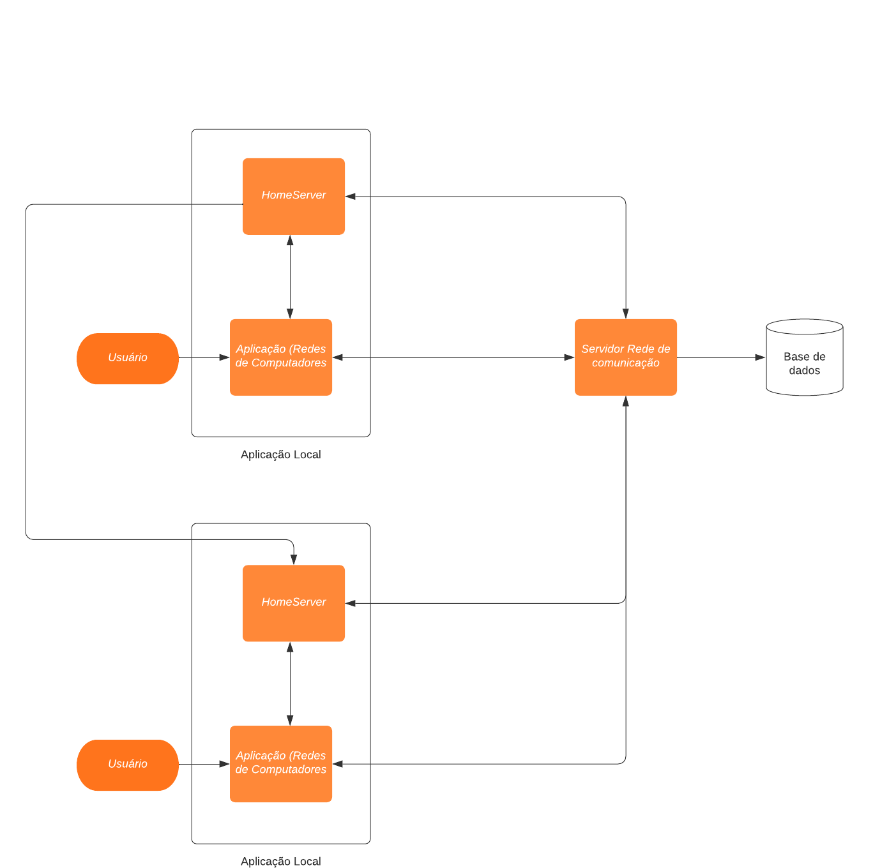

# Problema

Profissionais de saúde necessitam trocar informações entre eles visando a continuidade do cuidado de seus pacientes.
Uma rede deve ser criada visando facilitar e agilizar a interação entre profissionais da saúde. 
Possivelmente com a configuração de horários, por exemplo, na qual a comunicação é permitida, sugerida, assim como notificações e outros.
Deve ser possível realizar buscas por meio da especialidade, endereço de estabelecimento, nome do estabelecimento e outros. 
Também deve ser possível a troca de imagens e de texto por tempo limitado.
A rede deve viabilizar a comunicação sem revelar formas de contato pessoais como telefone, por exemplo.

## Projeto (design)

O software será composto por uma aplicação web integrada com um banco de dados.

### Descrição

A proposta é criar um sistema de chat entre profissionais de saude.

A aplicação terá a função de cadastro e de login para cada profissional de saúde. Ao realizar o cadastro os dados serão populados no banco e disponibilizados para que outros especialistas vizualizem e  entrem em contato.
Após o login, o profissional poderá acessar chat ou buscar por um novo profissional de saúde, escolhendo por especialidade, endereço, nome do estabelecimento ou profissional.

Após iniciar um chat com um profissional de saúde e enviar mensagens de texto ou imagem, o outro clínico será notificado por email de que um novo chat foi criado.
Dentro dos chats os profissionais de saúde podem optar por adicionar arquivos, ou enviar mensagens de texto.

Durante a criação do chat o responsavel pela criação pode determinar por quanto tempo esse chat continuará aberto, onde cada mensagem será limitada a 1000 caracteres e envios de arquivos serão restritos a 10 MB.

### Interface com o usuário

Ao abrir a aplicação, os usuários irão se deparar com uma tela de login. Nessa tela haverá a orientação para que eles insiram seus emails e senhas para realizar o login ou optem por criar uma nova conta.  
Na tela de criação de conta eles poderão fornecer seus emails, senha, nome, CRM, especialidade, local de trabalho e endereço.
Após realizar o login, haverá uma listagem de chats iniciados, ao final da listagem existirá um botão para a criação de novos chats.

Durante a criação de novos chats, o usuário será apresentado à seleção de filtros, podendo preencher o filtro de especialidade, endereço, nome do estabelecimento ou nome do trabalhador. 
Após aplicar filtros definidos, serão listados todos os profissionais que se incluem neste. A partir dessa lista será possivel criar um novo chat com o respectivo profissional.

Dentro dos chats serão listadas as mensagens enviadas. Mensagens de texto ficarão disponíveis diretamente e arquivos e fotos enviadas possuirão seus downloads permitidos. Também será disponibilizado um campo para preenchimento de texto e um botão para envio, assim como um botão para anexo de arquivos ou imagens.

### Segurança de dados

O programa deve utilizar métodos e ferramentes para garantir que as mensagens trocadas entre profissionais da saúde. Para isso, deve-se utilizar o SDL (Security Development Lifecycle, ou Ciclo de Desenvolvimento Seguro, em português) para como padrão de desenvolvimento

A comunicação entre aplicação local e servidor principal deve ser feita feita utilizando criptografia e cookies de segurança para confirmar origem das mensagens. 

O banco de dados e o serviço back-end devem ser estabelecidos no mesmo servidor e o banco terá conexão aberta unicamente para o back-end, de forma a impedir acessos indevidos ao mesmo.
Senhas devem ser armazenadas como hashMD5 de forma a não correr o risco de vazar a senha do usuário caso ocorra uma falha na segurança.

### Estrutura do projeto

O projeto será dividido em 3 partes: aplicação(Redes de Comunicação), homeserver e servidor principal:

A aplicação(Redes de Comunicação) irá englobar comunicação com o servidor principal, para obtenção de informações do banco de dados e validações, interface e client API da arquitetura Matrix.org, para comunicação com o homeserver.

O Homeserver será um serviço executada em conjunto com a aplicação(Redes de Comunicação), e consistirá na forma como as conexões entre médicos em tempo real irá ser estabelecida, cada Homeserver irá poder se comunicar com o servidor principal, a aplicação que executa no mesmo computador e outros homeserver.

O servidor principal será a parte que ficará responsavel para comunicar com o banco de dados e receber requisições das aplicações. Ele será hospedado em um servidor gerenciado pelo Rede de Comunicações

### Banco de dados

Utilizar padrão repository, como referencia o programa pode ter as tabelas:

Profissionais da saúde, conterão: senha, nome, email, especialidade, profissao, local_de_trabalho, endereço

Chats, conterão: profissional_criador, profissional_remetente

Mensagens, conterão: chat, tipo, conteudo, nome_arquivo

### Sistema de comunicação entre Partes

Com intuito de circunvir a sobrecarga de um servidor unico com a implementação de mensagens em tempo real, será buscado utilizar uma lógica de divisão de tráfego e comunicação descentralizada, utilizando a arquitetura [Matrix.org](https://matrix.org/), para o estabelecimento de mensagens em tempo real.

A implementação da arquitetura Matrix.org se dará em 3 partes, client, homeserver e Identity server.

O [client](https://spec.matrix.org/v1.2/client-server-api/) será a parte que será executada no usuário e terá como papel enviar as requisições de registro, mensagem, solicitação de inicio de conversas, etc. para o homeserver. Será executata em cada um dos usuários. E irá consistir na integração da aplicação Redes de comunicação com os homeservers responsaveis pela comunicação e o Identity Server

O [homeserver](https://spec.matrix.org/v1.2/server-server-api/), é a parte do Matrix.org responsavel pela comunicação, recebendo requisições do client e enviando para outros homeservers. Para sua implementação será utilizado uma implementação do homeserver [Synapse](https://github.com/matrix-org/synapse/). Ela será executada em cada um dos usuários.

O [Identity Server](https://spec.matrix.org/v1.2/identity-service-api/), será responsavel por forncer identidades de outros usuários e prover a localização de comunicação para com eles. Essa parte integrará as conexões do Matrix.org com os dados do banco, determinando qual médico representa o respectivo homeserver e iniciando corretamente as comunicações. Ela será uma aplicação unica executada em um servidor da redes de comunicação.

A estrutura do matrix permite que cada aplicação comunique independentemente com outras, reduzindo o trafego para apenas receber mensagens ou enviar mensagens para pessoas que com quem tem conversas.

### Diagrama de Contexto

Consulte o diretório [diagrama de contexto](../avaliacao4/diagrama-contexto)

### Diagrama de Arquitetura

## Requisitos

Consulte o diretório [requisitos](../avaliacao4/requisitos), que contém as listagens dos requisitos do software
