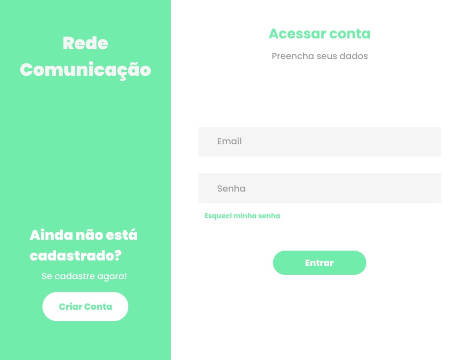
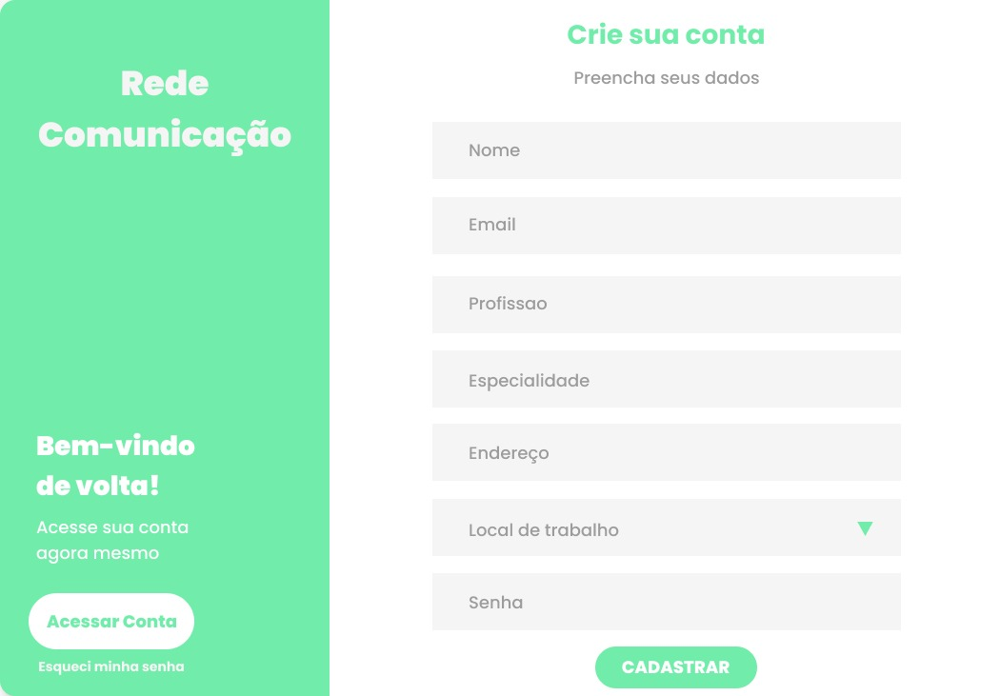

# Problema

Profissionais de saúde necessitam trocar informações entre eles visando a continuidade do cuidado de seus pacientes.
Uma rede deve ser criada visando facilitar e agilizar a interação entre profissionais da saúde. 
Possivelmente com a configuração de horários, por exemplo, na qual a comunicação é permitida, sugerida, assim como notificações e outros.
Deve ser possível realizar buscas por meio da especialidade, endereço de estabelecimento, nome do estabelecimento e outros. 
Também deve ser possível a troca de imagens e de texto por tempo limitado.
A rede deve viabilizar a comunicação sem revelar formas de contato pessoais como telefone, por exemplo.

## Projeto (design)

O software será composto por uma aplicação web integrada com um banco de dados.

### Descrição

A proposta é criar um sistema de chat entre profissionais de saude.

A aplicação terá a função de cadastro e de login para cada profissional de saúde. Ao realizar o cadastro os dados serão populados no banco e disponibilizados para que outros especialistas vizualizem e  entrem em contato.
Após o login, o profissional poderá acessar chat ou buscar por um novo profissional de saúde, escolhendo por especialidade, endereço, nome do estabelecimento ou profissional.

Após iniciar um chat com um profissional de saúde e enviar mensagens de texto ou imagem, o outro clínico será notificado por email de que um novo chat foi criado.
Dentro dos chats os profissionais de saúde podem optar por adicionar arquivos, ou enviar mensagens de texto.

Durante a criação do chat o responsavel pela criação pode determinar por quanto tempo esse chat continuará aberto, onde cada mensagem será limitada a 1000 caracteres e envios de arquivos serão restritos a 10 MB.

### Interface com o usuário

Ao abrir a aplicação, os usuários irão se deparar com uma tela de login. Nessa tela haverá a orientação para que eles insiram seus emails e senhas para realizar o login ou optem por criar uma nova conta.  

Na tela de criação de conta eles poderão fornecer seus emails, senha, nome, CRM, especialidade, local de trabalho e endereço.

Após realizar o login, haverá uma listagem de chats iniciados, ao final da listagem existirá um botão para a criação de novos chats.

Durante a criação de novos chats, o usuário será apresentado à seleção de filtros, podendo preencher o filtro de especialidade, endereço, nome do estabelecimento ou nome do trabalhador. Após aplicar filtros definidos, serão listados todos os profissionais que se incluem neste. A partir dessa lista será possivel criar um novo chat com o respectivo profissional.

Dentro dos chats serão listadas as mensagens enviadas. Mensagens de texto ficarão disponíveis diretamente e arquivos e fotos enviadas possuirão seus downloads permitidos. Também será disponibilizado um campo para preenchimento de texto e um botão para envio, assim como um botão para anexo de arquivos ou imagens.

### Segurança de dados

Devido a informações sensiveis que serão enviadas e armazenadas na aplicação é necessário ter medidas de contenção para evitar que ocorra vazamentos ou ataques. Dessa forma o programa deve utilizar métodos e ferramentes para garantir que as mensagens trocadas entre profissionais da saúde:

Senhas devem ser armazenadas como hashMD5 visto que não existe conversão de hash para texto e só seria possivel determinar a senha dos usuários caso o invasor tenha a mesma em uma tabela de conversão de texto para hash.

A aplicação deve realizar e verificar autenticação em todas as requisições e etapas, para evitar de permitir alguma requisição insegura.

O servidor principal deve permitir apenas as requisições desejadas para o funcionamento da aplicação e bloquear qualquer acesso indesejado ou que seja criado com intuito de ser utilizado apenas pela equipe de desenvolvimento, visto que caso esses acessos extras sejam descobertos poderiam gerar falhas de segurança e vazamentos de dado

Durante a implementação e ciclo de vida do produto deve se verificar as vulnerabilidades das dependências e aplicações utilizadas e realizar gerenciamento de versões para evitar a possibilidade de algum ataque que se beneficie dessas vulnerabilidades.

O uso da implementação dos homeservers do Matrix.Org irá contar com implementação de uma segurança e criptografia na troca de mensagens entre usuários, facilitando a implementação dos procedimentos de segurança para a proteção das mensagens.

A comunicação entre aplicação local e servidor principal deve ser feita feita utilizando criptografia e cookies de segurança para confirmar origem das mensagens. 

O banco de dados e o serviço back-end devem ser estabelecidos no mesmo servidor e o banco terá conexão aberta unicamente para o back-end, de forma a impedir acessos indevidos ao mesmo.

### Banco de dados

Utilizar padrão repository, como referencia o programa pode ter as tabelas:

Profissionais da saúde, conterão: senha, nome, email, especialidade, profissao, local_de_trabalho, endereço

Chats, conterão: profissional_criador, profissional_remetente

Mensagens, conterão: chat, tipo, conteudo, nome_arquivo

### Sistema de comunicação entre Partes

Será utilizado o AWS Chime para a comunicação entre partes. Com intuito de circunvir a sobrecarga de um servidor unico com a implementação de mensagens em tempo real, redução de partes que possam necessitar de manutenção, facilidade de construção e possibilitar que o programa seja executado em navegadores ou como API por outras aplicações.

Entre os serviços propostos pelo AWS Chime, pode-se citar a realização de chats, chamadas de vídeo, compartilhamento de tela e agendamentos de reuniões. Além disso, o serviço possui uma política de preços bem flexível. O pagamento ocorre conforme o uso, sem taxas adiantadas. Os desenvolvedores que implementarem o SDK podem optar por implementar as funcionalidades que forem desejadas no projeto.

A implementação se dará com a utilização dos padrões do AWS Chime e sua SDK

### Diagrama de Contexto

Consulte o diretório 

### Diagrama de Arquitetura

### Estrutura do projeto

O projeto poderá ser utilizado de duas formas, cada uma com sua estrutura, sendo elas:

A execução Web, onde será desenvolvido uma aplicação web que irá ter acesso ao AWS Chime via SDK, e ao servidor do Redes de comunicação. Permitindo os usuários de utilizarem diretamente a aplicação. O front end irá acessar o AWS Chime e o servidor via requisições.

A execução em outras aplicações, para poder fornecer facilidade de acesso a aplicação, será criada um API client que irá se comunicar com o servidor e com o AWS Chime

Além dessas partes terá o servidor principal que manterá acesso ao banco de dados e irá fornecer acesso a listagem de médicos para os usuários e permitirá o mapeamento entre identificações do AWS e dados de cadastro no banco.

A ultima estrutura será o AWS Chime que será acionado via SDK

## Requisitos

Consulte o diretório [requisitos](../avaliacao4/requisitos), que contém as listagens dos requisitos do software
